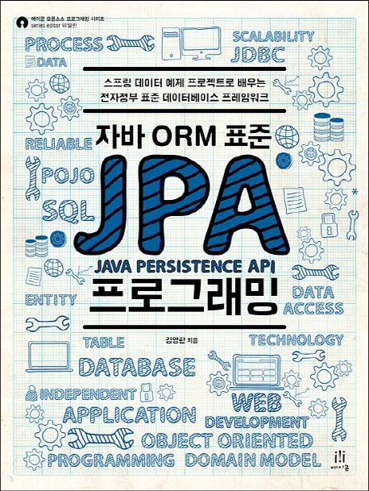

## contents

- 1장 JPA 소개
- 2장 JPA 시작
- 3장 영속성 관리
- 4장 엔티티 매핑
- 5장 연관관계 매핑 기초
- 6장 다양한 연관관계 매핑
- 7장 고급 매핑
- 8장 프록시와 연관관계 관리
- 9장 값 타입
- 10장 객체지향 쿼리 언어
- 11장 웹 애플리케이션 제작
- 12장 스프링 데이터 JPA
- 13장 웹 애플리케이션과 영속성 관리
- 14장 컬렉션과 부가 기능
- 15장 고급 주제와 성능 최적화
- 16장 트랜잭션과 락, 2차 캐시