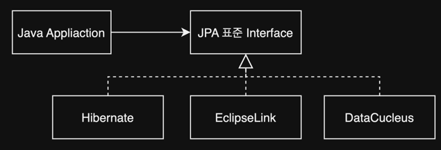

## 1장 JPA 소개

1. SQL을 직접 다룰 때 발생하는 문제점
    1. 반복, 반복 그리고 반복
    2. SQL에 의존적인 개발
    3. JPA와 문제 해결
2. 패러다임의 불일치
    1. 상속
    2. 연관관계
    3. 객체 그래프 탐색
    4. 비교
    5. 정리
3. JPA란 무엇인가?
    1. JPA 소개
    2. 왜 JPA를 사용해야 하는가?

- Q&A ORM에 대한 궁금증과 오해

---

## 1. SQL을 직접 다룰 때 발생하는 문제점

Java application은 JDBC API를 통해 DB에 접근한다.

### 1.1 반복, 반복 그리고 반복

CRUD 업무에 따른 SQL이 무수히 반복

```java
public class Member {
    private String memberId;
    private String name;
    // ...
}
//...

public class MemberDAO {
    public Member find(String memberId) {
        //...
    }
}
```

#### 조회

1. 회원 조회 SQL 작성
2. JDBC API로 SQL 실행
3. 조회 결과를 Member 객체에 매핑

#### 저장

1. 회원 등록 SQL 작성
2. Member 객체의 값을 꺼내 SQL에 바인딩
3. JDBC API로 SQL 실행

데이터 베이스가 아닌 자바 컬렉션에 저장한다면 아래로 충분하다.

```java
list.add(member);
```

### 1.2 SQL에 의존적인 개발

Member 객체에 속성이 추가된다면?

```java
public class Member {
    private String memberId;
    private String name;
    private String tel; // 속성 추가
}
```

#### 저장

1. Member class 수정
2. insert SQL 문 수정

조회, 저장, 수정 모두 수정 필요

#### 연관된 객체

```java
// Entity
public class Member {
    private String memberId;
    private String name;
    private Team team; //연관 객체
}

public class MemberDAO {
    public Member find(String memberId) {
    }

    public Member findWithTeam(String memberId) {
    } // 연관 객체 조회
}
```

#### 문제점

- SQL과 JDBC API를 DAO에 숨겼지만 논리적으로 Entity와 강한 결합이 형성
- 진정한 의미의 계층 분할 어려움
- Entity 신뢰 문제
- SQL에 의존적인 개발

### 1.3 JPA와 문제 해결

````
// 저장
jpa.persist(member);

// 조회
String memberId="helloId";
Member member=jpa.find(Member.class,memberId);

// 수정
Member member=jpa.find(Member.class,memberId);
member.setName("HelloJPA");

// 연관 객체 조회
Member member=jpa.find(Member.class,memberId);
Team team=member.getTeam();
````

## 2. 패러다임의 불일치

### 2.1 상속

객체는 상속이 있지만, 데이터베이스 테이블은 상속이 없음  
슈퍼타입, 서브타입 관계로 상속과 유사하게 설계 가능

```java
abstract class Human {
    private String name;
    private int age;
}

class IdolMember extends Human {
    private String group;
}

class Actor extends Human {
    private String agency;
}
```

`IdolMember` 객체 저장 시

````
INSERT INTO HUMAN ...
INSERT INTO IDOL_MEMBER ... 
````

java 컬렉션에 넣는다면 아래로 끝

````
list.add(idolMember);
````

#### JPA와 상속

```java
jpa.persist(idolMember);
```

위 코드로, `HUMAN`과 `IDOL_MEMBER` 테이블에 INSERT SQL이 실행

### 2.2 연관관계

- 객체 : 참조를 사용해서 연관된 객체를 조회
- 테이블 : FK를 사용해서 연관된 테이블을 조회

```java
class IdolMember extends Human {
    private String memberName;
    private Team team;
}

class Team {
    // ...
}
```

```sql
SELECT *
FROM IDOL_MEMBER
         JOIN TEAM ON IDOL_MEMBER.TEAM_ID = TEAM.TEAM_ID
```

#### 객체를 테이블에 맞추어 모델링

```java
class IdolMember extends Human {
    private String memberName;
    private int teamId; // 테이블 FK
}

class Team {
    // ...
}
```

- Team 객체 참조가 안됨 `teamId`만 있음

#### 객체지향 모델링

```java
class IdolMember extends Human {
    private int memberId;
    private String memberName;
    private Team team; // 객체 참조 연관관계
}

class Team {
    private int teamId;
    // ...
}
```

객체 모델에선 참조만 필요하고, 테이블에선 FK만 필요한 상황

````
// 저장
idolMember.getMemeberName();
idolMember.getTeam().getTeamId();

// 조회
SELECT *
FROM IDOL_MEMBER
         JOIN TEAM ON IDOL_MEMBER.TEAM_ID = TEAM.TEAM_ID
         
// 개발자가 직접 연관관계 매핑
IdolMember idolMember = dao.getMember();
Team team = dao.getTeam();
idolMember.setTeam(team);
````

#### JPA와 연관관계

````
// 저장
idolMember.setTeam(team); // 연관관계 설정
jpa.persist(idolMember); // 연관관계를 함께 저장

// 조회
IdolMember idolMember = jpa.find(IdolMember.class, memberId);
Team team = idolMember.getTeam(); // 연관 객체
````

### 2.3 객체 그래프 탐색

- 객체 그래프 탐색 : 참조된 객체를 찾아가는 것 `idolMember.getTeam().getNation()...`
- SQL join 이 `TEAM` 에서 멈췄다면 `Nation` 까지 찾아가지 못함. Null 반환
- 객체 그래프 탐색을 위해 DAO에 가서 직접 SQL을 확인해봐야함
- 모든 객체 그래프를 SQL에서 SELECT 해서 메모리에 올리면 비효율적

#### JPA와 객체 그래프 탐색

- 지연로딩을 통해 객체 그래프 탐색
- 지연로딩 : 연관객체를 실제 사용하는 시점까지 SELECT SQL을 미루는 것

````
IodlMember iolMember=jpa.find(IdolMember.class,memberId); // SQL : SELECT FROM IDOL_MEMBER

Team team=idolMember.getTeam();
team.getTeamName(); // SQL : SELECT FROM TEAM
````

- 즉시 로딩 : 연관된 객체를 미리 JOIN해서 함께 조회

### 2.4 비교

- 동등성 비교 : `==`, 데이터베이스의 row, 객체 인스턴스의 주소값 비교
- 동일성 비교 : `equals()`, 데이터베이스 row의 데이터, 객체 내부 값 비교
- 데이터베이스와 객체가 서로 비교 기준이 다름

````
int memberId=100;
IdolMember idolMember1 = dao.getMember(memberId);
IdolMember idolMember2 = dao.getMember(memberId);

idolMember1==idolMember2; // false
````

#### JPA와 비교

````
int memberId=100;
IdolMember idolMember1=jpa.find(IdolMember.class,memberId);
IdolMember idolMember2=jpa.find(IdolMember.class,memberId);

idolMember1==idolMember2; // true
````

### 2.5 정리

- 패러다임 불일치 문제 : 객체는 인스턴스로 참조하고, 데이터베이스는 FK로 참조함
- 즉, 서로 지향하는 패러다임이 달라 그걸 개발자가 일일이 전환해주어야함

## 3. JPA란 무엇인가?


- JPA, Java Persistence API
- 자바 진영의 ORM 기술 표준

#### ORM, Object-Relational Mapping

- 객체와 RDBMS 간의 매핑을 해주는 Framework
- 객체와 RDBMS 테이블을 매핑해서 패러다임 불일치 문제 해결
- RDBMS에 객체 저장 시 SQL을 직접 작성하지 않고, Java Colelction에 객체를 저장하듯이 저장
- 객체, 테이블을 각자 모델링하고 mapping 방안을 ORM framework에게 명시
- e.g. Hibernate, EclipseLink, DataNucleus
    - Hibernate가 가장 많이 쓰임

#### 저장


#### 조회


### 3.1 JPA 소개



- JPA : `Hibernate`를 기반의 새로운 Java ORM 표준
- Interface이기 떄문에 실제 구현체를 선택해야함
- **`Hibernate`가 가장 대중적**

### 3.2 왜 JPA를 사용해야 하는가?

#### 생산성

- 반복적인 CRUD SQL 작성을 JPA가 대신 처리
- DDL 자동 생성도 있음

#### 유지보수

- SQL 의존 개발은 Entity의 수정이 있으면 API 모든 부분이 수정되어야함
- JPA는 Entity의 수정에 따른 영향 범위가 적음
- 패러다임 불일치이 해결되어서 객체지향적 모델링이 가능

#### 패러다임의 불일치 해결

- Java application과 DBMS 사이에서 다양한 성능 최적화 기능을 제공
- SQL 실행 횟수, hint 등

````
int memberId = 100;
IdolMember idolMember1 = jpa.find(IdolMember.class, memberId);
IdolMember idolMember2 = jpa.find(IdolMember.class, memberId);

// 실제 한번만 SQL SELECT 를 실행함
````

#### 데이터 접근 추상화와 벤더 독립성

- JPA는 특정 DBMS에 종속되지 않음
    - e.g. 로컬은 H2, 운영은 Oracle

#### 표준

- JPA는 Java ORM의 기술 표준

## 4. 정리